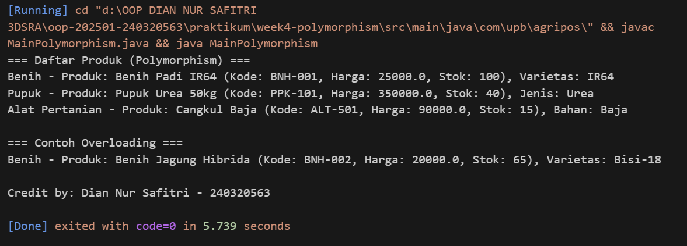

# Laporan Praktikum Minggu 4 
Topik: "Polymorphism"

## Identitas
- Nama  : [Dian Nur Safitri]
- NIM   : [240320563]
- Kelas : [3DSRA]

---

## Tujuan
- Mampu menjelaskan konsep polymorphism dalam OOP.
- Mampu membedakan method overloading dan overriding.
- Mampu mengimplementasikan polymorphism (overriding, overloading, dynamic binding) dalam program.
- Mampu menganalisis contoh kasus polymorphism pada sistem nyata (Agri-POS).

---

## Dasar Teori
Polymorphism berarti "banyak bentuk" dan memungkinkan objek yang berbeda merespons panggilan method yang sama dengan cara yang berbeda.
1. Overloading : mendefinisikan method dengan nama sama tetapi parameter berbeda.  
2. Overriding : subclass mengganti implementasi method dari superclass. 
3. Dynamic binding : pemanggilan method ditentukan saat runtime, bukan compile time.

Dalam konteks Agri-POS, misalnya:
- Method getInfo() pada Produk dioverride oleh Benih, Pupuk, AlatPertanian untuk menampilkan detail spesifik.
- Method tambahStok() bisa dibuat overload dengan parameter berbeda (int, double).

---

## Langkah Praktikum
1. Overloading
   - Tambahkan method tambahStok(int jumlah) dan tambahStok(double jumlah) pada class Produk.
2. Overriding
   - Tambahkan method getInfo() pada superclass Produk.
   - Override method getInfo() pada subclass Benih, Pupuk, dan AlatPertanian.
3. Dynamic Binding
   - Buat array Produk[] daftarProduk yang berisi objek Benih, Pupuk, dan AlatPertanian.
   - Loop array tersebut dan panggil getInfo(). Perhatikan bagaimana Java memanggil method sesuai jenis objek aktual.
4. Main Class
   - Buat MainPolymorphism.java untuk mendemonstrasikan overloading, overriding, dan dynamic binding.
5. CreditBy
   - Tetap panggil CreditBy.print("<NIM>', "<Nama>").
6. Commit dan Push
   - Commit dengan Pesan: week4-polymorhism.

---

## Kode Program

```java

//Produk
package model;

public class Produk {
    private String kode;
    private String nama;
    private double harga;
    private int stok;

    public Produk(String kode, String nama, double harga, int stok) {
        this.kode = kode;
        this.nama = nama;
        this.harga = harga;
        this.stok = stok;
    }

    // Overloading
    public void tambahStok(int jumlah) {
        this.stok += jumlah;
    }

    public void tambahStok(double jumlah) {
        this.stok += (int) jumlah;
    }

    // Getter
    public String getKode() { return kode; }
    public String getNama() { return nama; }
    public double getHarga() { return harga; }
    public int getStok() { return stok; }

    // Method yang akan dioverride
    public String getInfo() {
        return "Produk: " + nama + " (Kode: " + kode + ", Harga: " + harga + ", Stok: " + stok + ")";
    }
}

//Benih
package model;

public class Benih extends Produk {
    private String varietas;

    public Benih(String kode, String nama, double harga, int stok, String varietas) {
        super(kode, nama, harga, stok);
        this.varietas = varietas;
    }

    @Override
    public String getInfo() {
        return "Benih - " + super.getInfo() + ", Varietas: " + varietas;
    }
}

//Pupuk
package model;

public class Pupuk extends Produk {
    private String jenis;

    public Pupuk(String kode, String nama, double harga, int stok, String jenis) {
        super(kode, nama, harga, stok);
        this.jenis = jenis;
    }

    @Override
    public String getInfo() {
        return "Pupuk - " + super.getInfo() + ", Jenis: " + jenis;
    }
}

//AlatPertanian
// Source code is decompiled from a .class file using FernFlower decompiler (from Intellij IDEA).
package model;

public class Benih extends Produk {
   private String varietas;

   public Benih(String var1, String var2, double var3, int var5, String var6) {
      super(var1, var2, var3, var5);
      this.varietas = var6;
   }

   public String getInfo() {
      String var10000 = super.getInfo();
      return "Benih - " + var10000 + ", Varietas: " + this.varietas;
   }
}

//CreditBy
package util;

public class CreditBy {
    public static void tampilkan(String nama, String nim) {
        System.out.println("\nCredit by: " + nama + " - " + nim);
    }
}

//Polymorphism
import model.*;
import util.*;

public class MainPolymorphism {
    public static void main(String[] args) {
        // Dynamic binding: semua disimpan sebagai Produk
        Produk[] daftarProduk = {
            new Benih("BNH-001", "Benih Padi IR64", 25000, 100, "IR64"),
            new Pupuk("PPK-101", "Pupuk Urea 50kg", 350000, 40, "Urea"),
            new AlatPertanian("ALT-501", "Cangkul Baja", 90000, 15, "Baja")
        };

        System.out.println("=== Daftar Produk (Polymorphism) ===");
        for (Produk p : daftarProduk) {
            System.out.println(p.getInfo());
        }

        // Overloading
        System.out.println("\n=== Contoh Overloading ===");
        Produk benih = new Benih("BNH-002", "Benih Jagung Hibrida", 20000, 50, "Bisi-18");
        benih.tambahStok(10);      // int
        benih.tambahStok(5.5);     // double
        System.out.println(benih.getInfo());

        CreditBy.tampilkan("Dian Nur Safitri", "240320563");
    }
}

---

## Hasil Eksekusi
(Sertakan screenshot hasil eksekusi program.  

)
---

## Analisis
1. Cara Kerja Kode
   Program ini menerapkan konsep **polymorphism** dengan `Produk` sebagai class induk yang memiliki atribut umum seperti kode, nama, harga, dan stok. Class ini juga memiliki method `tambahStok()` yang **dioverload** agar dapat menerima parameter `int` maupun `double`, serta method `getInfo()` yang menampilkan informasi dasar produk.

   Dari class `Produk` diturunkan tiga subclass, yaitu `Benih`, `Pupuk`, dan `AlatPertanian`, yang masing-masing menambahkan atribut spesifik seperti varietas, jenis, dan bahan. Ketiganya melakukan **overriding** terhadap `getInfo()` untuk menampilkan detail tambahan produk.

   Pada class `MainPolymorphism`, dibuat array `Produk[]` yang berisi berbagai objek subclass. Walau disimpan dalam tipe `Produk`, setiap objek tetap menampilkan perilaku sesuai jenisnya melalui mekanisme **dynamic binding**, di mana method `getInfo()` yang dijalankan disesuaikan dengan tipe objek sebenarnya saat runtime. Program diakhiri dengan pemanggilan `CreditBy.tampilkan()` untuk menampilkan identitas pembuat.
2. Perbedaan dengan Praktikum Sebelumnya
   Terdapat perbedaan dengan praktikum minggu sebelumnya, di mana pembahasan sebelumnya berfokus pada konsep inheritance, yaitu bagaimana suatu class dapat menurunkan atribut dan method pada subclass. Sementara itu, praktikum minggu ini fokus pada penerapan polymorphism dan method overriding, yang mana subclass dapat memodifikasi perilaku method dari superclass. Melalui polymorphism, objek-objek yang berbeda dapat diakses menggunakan satu referensi umum dan program akan menyesuaikan method yang dijalankan secara dinamis.
3. Kendala yang Dihadapi
   Kendala yang dihadapi pada praktikum kali ini muncul pada saat proses kompilasi dan eksekusi program berupa error "invalid filename" dan "Class not found exception". Kendala ini terjadi karena struktur direktori dan perintah kompilasi Java belum diarahkan sesuai dengan lokasi file program. Perlu dilakukan kompilasi ulang dengan menyesuaikan lokasi file agar hasil kompilasi tersimpan di dalam folder bin, sehingga program sepenuhnya bisa dijalankan serta menampilkan hasil output yang diinginkan.


---

## Kesimpulan
   Secara keseluruhan, program ini berhasil memperlihatkan penerapan konsep polymorphism dengan baik. Penerapan ini menunjukkan bagaimana polymorphism memungkinkan satu tipe referensi tunggal di superclass untuk merepresentasikan berbagai bentuk method pada subclass tanpa memerlukan pengondisian yang kompleks seperti if-else atau switch. Jika di masa mendatang dilakukan penambahan subclass dari superclass, maka sistem dapat secara otomatis menanganinya tanpa mengubah logika utama pada class polymorphism. Selain itu, hasil output program menunjukkan bahwa setiap objek menampilkan detail informasi yang berbeda sesuai dengan jenis produknya. Hal ini mempertegas bahwa overriding berhasil diterapkan dengan benar dan sistem mampu mengenali serta mengeksekusi method yang sesuai dengan class masing-masing. Konsep ini membuat program menjadi lebih efisien, terstruktur, dan fleksibel untuk dikembangkan sesuai kebutuhan Agri-POS.

---

## Quiz
1. Apa perbedaan overloading dan overriding?  
   *Jawaban:* Overloading terjadi ketika terdapat penggunaan beberapa method dengan nama yang sama namun memiliki parameter yang berbeda dalam satu class, baik jumlah, tipe data, maupun urutan. Tujuannya adalah memberikan kemudahan bagi pengguna untuk memanggil method yang sama dengan variasi input yang berbeda tanpa harus membuat nama method baru. Sedangkan overriding terjadi ketika sebuah subclass mengganti implementasi method dari superclass dengan nama dan parameter yang sama namun dengan isi berbeda. Tujuannya adakah agar setiap subclass dapat menyesuaikan perilaku method sesuai kebutuhan spesifiknya.

2. Bagaimana Java menentukan method mana yang dipanggil dalam dynamic binding?  
   *Jawaban:* Dalam java, dynamic binding menentukan method yang dijalankan berdasarkan objek sebenarnya saat program dieksekusi, bukan berdasarkan tipe referensinya. Proses ini terjadi pada tahap runtime, ketika referensi superclass menunjuk pada objek subclass, maka method yang dipanggil adalah milik subclass tersebut. 

3. Berikan contoh kasus polymorphism dalam sistem POS selain produk pertanian!  
   *Jawaban:* Dalam konteks POS, penerapan polymorphism dapat diimplementasikan juga pada POS Fashion Store. sebagai contoh, superclass Produk dapat diturunkan menjadi subclass seperti Baju, Celana, dan Aksesoris, yang masing-masing memiliki atribut dan perilaku khusus, misalnya atribut tambahan berupa Ukuran, Jenis kain, Warna, dan lain sebagainya. Ketika program memanggil method getInfo() melalui Produk, maka hasil output akan menampilkan informasi spesifik sesuai objek sebenarnya.
