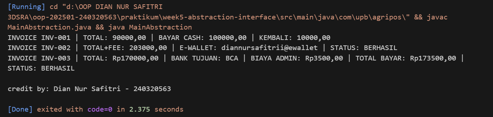

# Laporan Praktikum Minggu 5
Topik: Abstraction

## Identitas
- Nama  : [Dian Nur Safitri]
- NIM   : [240320563]
- Kelas : [3DSRA]

---

## Tujuan
- Mahasiswa mampu **menjelaskan perbedaan abstract class dan interface**.
- Mahasiswa mampu **mendesain abstract class dengan method abstrak** sesuai kebutuhan kasus.
- Mahasiswa mampu **membuat interface dan mengimplementasikannya pada class**.
- Mahasiswa mampu **menerapkan multiple inheritance melalui interface** pada rancangan kelas.
- Mahasiswa mampu **mendokumentasikan kode** (komentar kelas/method, README singkat pada folder minggu)

---

## Dasar Teori
**Abstraksi** adalah proses menyederhanakan kompleksitas dengan menampilkan elemen penting dan menyembunyikan detail implementasi.
- **Abstract class**: tidak dapat diinstansiasi, dapat memiliki method abstrak (tanpa badan) dan non-abstrak. Dapat menyimpan state (field).
- **Interface**: kumpulan kontrak (method tanpa implementasi konkret). Sejak Java 8 mendukung default method. Mendukung **multiple inheritance** (class dapat mengimplementasikan banyak interface).
- Gunakan **abstract class** bila ada _shared state_ dan perilaku dasar; gunakan **interface** untuk mendefinisikan kemampuan/kontrak lintas hierarki.

Dalam konteks Agri-POS, **Pembayaran** dapat dimodelkan sebagai abstract class dengan method abstrak `prosesPembayaran()` dan `biaya()`. Implementasi konkritnya: `Cash` dan `EWallet`. Kemudian, interface seperti `Validatable` (mis. verifikasi OTP) dan `Receiptable` (mencetak bukti) dapat diimplementasikan oleh jenis pembayaran yang relevan.

---

## Langkah Praktikum
1. **Abstract Class – Pembayaran**
   - Buat `Pembayaran` (abstract) dengan field `invoiceNo`, `total` dan method:
     - `double biaya()` (abstrak) → biaya tambahan (fee).
     - `boolean prosesPembayaran()` (abstrak) → mengembalikan status berhasil/gagal.
     - `double totalBayar()` (konkrit) → `return total + biaya();`.

2. **Subclass Konkret**
   - `Cash` → biaya = 0, proses = selalu berhasil jika `tunai >= totalBayar()`.
   - `EWallet` → biaya = 1.5% dari `total`; proses = membutuhkan validasi.

3. **Interface**
   - `Validatable` → `boolean validasi();` (contoh: OTP).
   - `Receiptable` → `String cetakStruk();`

4. **Multiple Inheritance via Interface**
   - `EWallet` mengimplementasikan **dua interface**: `Validatable`, `Receiptable`.
   - `Cash` setidaknya mengimplementasikan `Receiptable`.

5. **Main Class**
    - Buat `MainAbstraction.java` untuk mendemonstrasikan pemakaian `Pembayaran` (polimorfik).
    - Tampilkan hasil proses dan struk. Di akhir, panggil `CreditBy.print("[NIM]", "[Nama]")`.

6. **Commit dan Push**
   - Commit dengan pesan: `week5-abstraction-interface`.

---

## Kode Program

```java

import model.kontrak.Receiptable;
import model.pembayaran.Cash;
import model.pembayaran.EWallet;
import model.pembayaran.Pembayaran;
import model.pembayaran.TransferBank;
import util.CreditBy;


public class MainAbstraction {
    public static void main(String[] args) {
        Pembayaran cash = new Cash("INV-001", 90000, 100000);
        Pembayaran ew = new EWallet("INV-002", 200000, "diannursafitrii@ewallet", "123456");
        Pembayaran transfer = new TransferBank("INV-003", 170000, "BCA", true);


        System.out.println(((Receiptable) cash).cetakStruk());
        System.out.println(((Receiptable) ew).cetakStruk());
        System.out.println(((Receiptable) transfer).cetakStruk());
    
        CreditBy.print("Dian Nur Safitri", "240320563");
    }
}
---

## Hasil Eksekusi
(Sertakan screenshot hasil eksekusi program.  

)
---

## Analisis
   -Program ini menerapkan konsep **abstraksi** melalui *abstract class* `Pembayaran` yang menjadi kerangka dasar bagi berbagai jenis pembayaran seperti `Cash`, `EWallet`, dan `TransferBank`. Masing-masing subclass mengimplementasikan method abstrak `biaya()` dan `prosesPembayaran()` sesuai karakteristiknya.
   -Penggunaan **interface** `Receiptable` dan `Validatable` menunjukkan penerapan **multiple inheritance** secara aman di Java, karena satu class dapat memiliki beberapa kemampuan tanpa konflik pewarisan. Pada `MainAbstraction`, konsep **polymorphism** ditunjukkan ketika objek `Pembayaran` memanggil method sesuai tipe konkret masing-masing.
   -Dibanding minggu sebelumnya, pendekatan ini lebih fleksibel dan terstruktur karena memisahkan tanggung jawab antara kelas dasar dan perilaku tambahan. Kendala yang muncul seperti error struktur *package* berhasil diatasi dengan memperbaiki deklarasi dan jalur kompilasi proyek.

---

## Kesimpulan
   Abstraksi berperan penting dalam menyederhanakan sistem dengan menonjolkan elemen-elemen yang relevan dan menyembunyikan detail implementasi yang tidak diperlukan. Melalui konsep ini, **abstract class** digunakan untuk mendefinisikan kerangka dasar dengan perilaku umum yang dapat diwariskan oleh subclass, sementara **interface** berfungsi sebagai kontrak yang harus diimplementasikan oleh class sehingga memungkinkan penerapan **multiple inheritance** secara aman di Java. Dalam penerapan pada kasus *Agri-POS*, konsep abstraksi membuat sistem pembayaran menjadi lebih fleksibel dan terstruktur, di mana jenis pembayaran seperti *Cash* dan *EWallet* dapat memiliki perilaku spesifik masing-masing namun tetap mengikuti pola serta kontrak yang sama. Praktikum ini memperdalam pemahaman mengenai konsep **polymorphism**, **abstraction**, dan **interface implementation** dalam pengembangan sistem berbasis objek yang efisien dan terorganisir.
---

## Quiz
1. Jelaskan perbedaan konsep dan penggunaan **abstract class** dan **interface**.  
   **Jawaban:** 
   -Abstract class digunakan saat beberapa class memiliki perilaku dan atribut dasar yang sama. Dapat berisi method abstrak (tanpa implementasi) dan non-abstrak (dengan implementasi).
   -Interface hanya mendefinisikan kontrak perilaku tanpa menyimpan state. Setiap class yang mengimplementasikan interface wajib menyediakan implementasinya.
   -Gunakan abstract class untuk hubungan “is-a” dalam satu hierarki, dan interface untuk kemampuan umum lintas hierarki (misalnya Printable, Comparable, Receiptable).

2. Mengapa **multiple inheritance** lebih aman dilakukan dengan interface pada Java?  
   **Jawaban:** 
   Karena Java tidak mendukung pewarisan ganda antar class untuk menghindari konflik diamond problem (dua superclass punya method dengan nama sama). Interface hanya berisi deklarasi method (tanpa state), sehingga tidak menyebabkan konflik pewarisan dan lebih aman digunakan untuk multiple inheritance.

3. Pada contoh Agri-POS, bagian mana yang **paling tepat** menjadi abstract class dan mana yang menjadi interface? Jelaskan alasannya.  
   **Jawaban:** 
   -Abstract class: Pembayaran → karena semua jenis pembayaran memiliki struktur dan atribut dasar yang sama seperti invoiceNo, total, serta method umum totalBayar().
   -Interface: Validatable dan Receiptable → karena merupakan kemampuan tambahan yang bisa dimiliki berbagai jenis pembayaran tanpa harus berada dalam satu hierarki yang sama (misalnya EWallet dan Cash sama-sama bisa mencetak struk).
